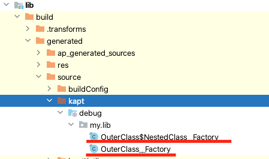
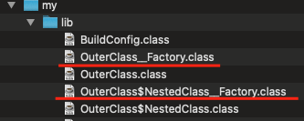
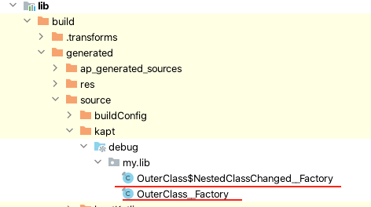
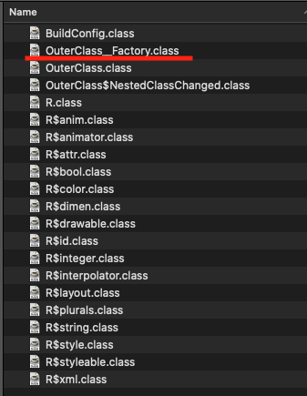

# Tasks input changes detection is broken

Sample project that reproduces bug (?) with wrong input changes detection for Gradle-task in specific case
Can be reproduced with Gradle 7.3 and Gradle 7.3.1, but doesn't reproduce with Gradle 7.2 and earlier versions

## Project structure

Almost empty Android project that has Android app module and Android library module

Android library module (:lib) contains two classes (OuterClass and NestedClass) with annotation 
that allows annotation processor to generate additional files based on them 
(typical DI factories in this sample).

**Important note:** nested class is a vital piece to reproduce the bug in this project but probably 
it may be also reproduced in other ways

## Scenario

1. Run first build of the project (./gradlew :app:assembleDebug)
2. Change name of nested class (NestedClass in subproject :lib) to "NestedClassChanged" for example
3. Run build again
4. Run app and check crash in runtime with 
   "Didn't find class "my.lib.OuterClass$NestedClassChanged__Factory" on path: DexPathList" 
   error message in LogCat

### Details and relation to Gradle

After first run we can check classes generated by annotation processor at lib/build/generated/source/kapt:

Also we can check their presence in resulting jar file for this library at lib/build/intermediates/compile_library_classes_jar/debug/classes.jar: 

Now we will change the name of the nested class (OuterClass$NestedClass -> OuterClass$NestedClassChanged),
rebuild the project and check it again:

Now to our lib/build/intermediates/compile_library_classes_jar/debug/classes.jar:

We can find generated class for OuterClass, but there is no OuterClass$NestedClassChanged_Factory, that should be 
packaged from compiled lib/build/generated/source/kapt/OuterClass$NestedClassChanged__Factory.java

Let's clear build directory of :lib subproject and try to reproduce this behavior with task 
:lib:bundleLibCompileToJarDebug and --info to get more insights

First build with nested class called NestedClass: 

> Task :lib:bundleLibCompileToJarDebug
Caching disabled for task ':lib:bundleLibCompileToJarDebug' because:
Build cache is disabled
Task ':lib:bundleLibCompileToJarDebug' is not up-to-date because:
Output property 'output' file /Users/k.dubinko/Source/Android/CacheIssueRepro/lib/build/intermediates/compile_library_classes_jar/debug/classes.jar has been removed.
:lib:bundleLibCompileToJarDebug (Thread[Daemon worker Thread 21,5,main]) completed. Took 0.006 secs.

classes.jar for this module was generated from scratch and contains all generated classes, that's OK.

Then we change name for nested class again (NestedClass -> NestedClassChanged) and look for **most important part**:

> Task :lib:bundleLibCompileToJarDebug
Caching disabled for task ':lib:bundleLibCompileToJarDebug' because:
Build cache is disabled
Task ':lib:bundleLibCompileToJarDebug' is not up-to-date because:
Input property 'classes' file .../lib/build/intermediates/javac/debug/classes/my/lib/OuterClass$NestedClass__Factory.class has been removed.
Input property 'classes' file .../lib/build/intermediates/javac/debug/classes/my/lib/OuterClass__Factory.class has been added.
Input property 'classes' file .../lib/build/intermediates/javac/debug/classes/my/lib/OuterClass__Factory.class has been removed.
:lib:bundleLibCompileToJarDebug (Thread[Execution worker for ':',5,main]) completed. Took 0.007 secs.

Detected changes:

OuterClass$NestedClass__Factory.class has been removed.
OuterClass__Factory.class has been added.
OuterClass__Factory.class has been removed.

For some reason Gradle hasn't detected addition of OuterClass$NestedClass__Factory.class as an input for bundleLibCompileToJarDebug
I guess that lack of detection for this change from Gradle is a reason for this unexpected behavior

## Some additional notes

- No kinds of Gradle cache used in this project, only compile avoidance and UP-TO-DATE detection mechanism of Gradle
- AGP version 7.0.3
